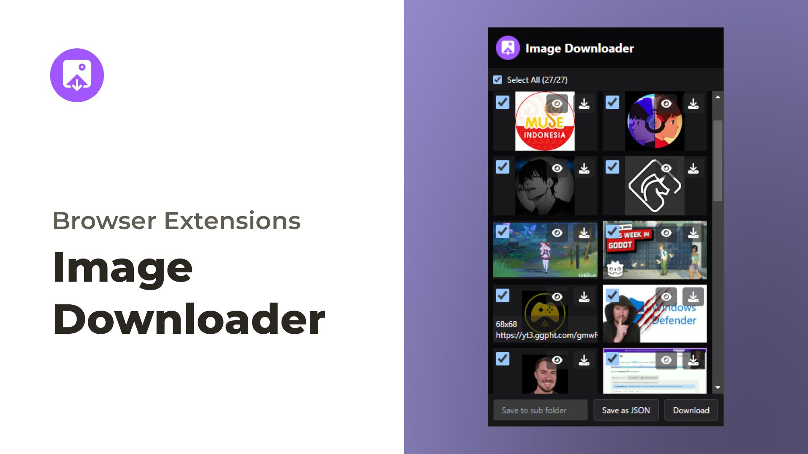

# Image Downloader

> A browser extension that makes downloading images from the web easier and adds useful features.



## Features

- Multiple image downloads

## Download

Get the app from our [releases page](https://github.com/zeindevs/imagedl-extensions/releases).

If you want to try new features before they get to the stable release, you can download the preview version [here](https://github.com/zeindevs/imagedl-extensions-preview/releases).

## License

```
Copyright 2024 zeindevs

Licensed under the Apache License, Version 2.0 (the "License");
you may not use this file except in compliance with the License.
You may obtain a copy of the License at

   http://www.apache.org/licenses/LICENSE-2.0

Unless required by applicable law or agreed to in writing, software
distributed under the License is distributed on an "AS IS" BASIS,
WITHOUT WARRANTIES OR CONDITIONS OF ANY KIND, either express or implied.
See the License for the specific language governing permissions and
limitations under the License.
```
